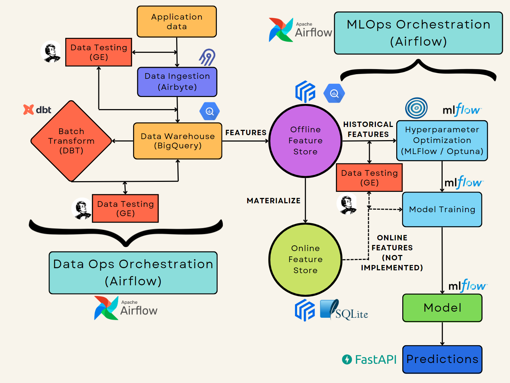
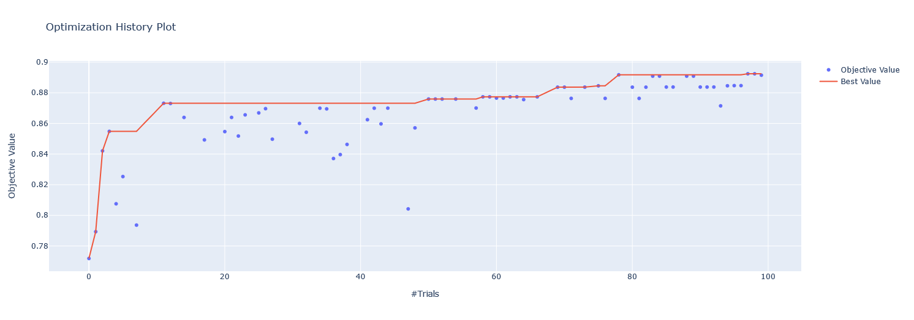
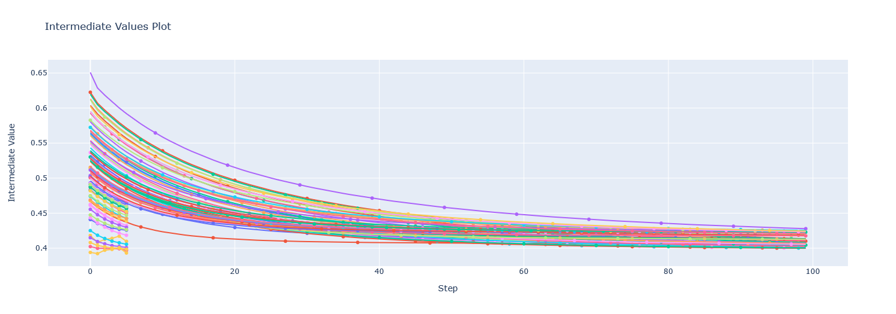
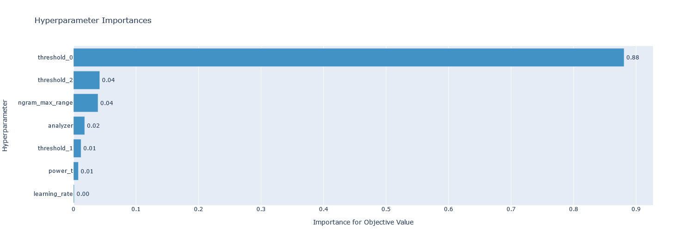

# ClassifyOps, a MLOps Text Classification Project

In this project, I apply MLOps and DataOps practices to the deployment
of a text classification model aiming at classifying ML projects in
different categories.

## Project Flowchart




The different steps of this project include:

- Development of a MVP model on Jupyter Notebook
- Experiment Tracking with MLFlow
- Hyperparameter optimization with Optuna
- Project packaging, dockerizing and deployment on FastAPI
- Data visualization on Streamlit
- Test-driven development with Pytest - Great-Expectations (GE)
- Code cleaning and documentation ([Link](https://faskill.github.io/MLOps-Text-Classification/))
with mkdocs, flake8, isort and black.
- Data and model versioning using DVC and Github
- Implementation of CI/CD pratices with Github actions / pre-commit
- Creation of a modern data stack including Airbyte, BigQuery and dbt
- Orchestration of the DataOps pipeline in a [separate repository](https://github.com/Faskill/data-engineering) with Airflow
- Orchestration of the MLOps pipeline with Airflow
- Creation of a feature store with Feast

## Experiment Tracking



## Pruning



## Hyperparameter importance



## Useful Links

* [Jupyter Notebook (POC - Tracer Bullet)](Notebook.ipynb)
* [Packaged Project Folder](classifyops/)
* [FastAPI Folder](app/)
* [Streamlit Folder](streamlit/)
* [Dockerfile](Dockerfile)
* [Testing folder (including Great Expectations)](/tests/)
* [MLOps Airflow pipeline](/airflow)
* [DataOps Airflow pipeline (separate repository)](https://github.com/Faskill/data-engineering)
* [Root repository Folder](https://github.com/Faskill/MLOps-Text-Classification)

## Libraries / Packages Used

* [Feast](https://feast.dev/)
* [Apache Airflow](https://airflow.apache.org/)
* [BigQuery](https://cloud.google.com/bigquery)
* [Airbyte](https://airbyte.com/)
* [Isort](https://pycqa.github.io/isort/)
* [Flake8](https://flake8.pycqa.org/)
* [Black](https://black.readthedocs.io/)
* [Mkdocs](https://www.mkdocs.org/)
* [Pre-commit](https://pre-commit.com/)
* [Great-expectations](https://greatexpectations.io/)
* [Pytest](https://pytest.org/)
* [DVC](https://dvc.org/)
* [Streamlit](https://streamlit.io/)
* [FastAPI](https://fastapi.tiangolo.com/)
* [Rich](https://rich.readthedocs.io/en/stable/introduction.html)
* [MLFlow](https://mlflow.org/)
* [Snorkel](https://www.snorkel.org/)
* [Imbalanced-Learn](https://imbalanced-learn.org/)
* [Scikit-Learn](https://scikit-learn.org/)
* [nltk](https://www.nltk.org/)
* Pandas / Numpy

## Quick how-to

### Virtual environment creation

```bash
python3 -m venv venv
source venv/bin/activate
python3 -m pip --upgrade pip
python3 -m pip install pip setuptools wheel
python3 -m pip install -e .
```
### Launching App
```bash
uvicorn app.api:app --host 0.0.0.0 --port 8000 --reload --reload-dir classifyops --reload-dir app  # dev
gunicorn -c app/gunicorn.py -k uvicorn.workers.UvicornWorker app.api:app  # prod
```

### Building docker container
```bash
docker build -t classifyops:latest -f Dockerfile .
```

### Running container
```bash
docker run -p 8000:8000 --name classifyops classifyops:latest
```

### Airflow orchestration (MLOps)

On one terminal (in the root project dir), launch airflow server:
```bash
source venv/bin/activate
export AIRFLOW_HOME=${PWD}/airflow
export GOOGLE_APPLICATION_CREDENTIALS=/Link/to/BigQuery/JSON/file.json
airflow webserver --port 8080
```

On a second terminal, launch airflow scheduler:
```bash
source venv/bin/activate
export AIRFLOW_HOME=${PWD}/airflow
export OBJC_DISABLE_INITIALIZE_FORK_SAFETY=YES
export GOOGLE_APPLICATION_CREDENTIALS=/Link/to/BigQuery/JSON/file.json
airflow scheduler
```

The Airflow orchestration workflow (DAG) can be launched from your browser on
http://localhost:8080 :


## Developed By

Octave Antoni


[Connect with me on Linkedin](https://www.linkedin.com/in/octave-antoni/)

## License

    Copyright 2023 Octave Antoni

    Licensed under the Apache License, Version 2.0 (the "License");
    you may not use this file except in compliance with the License.
    You may obtain a copy of the License at

        http://www.apache.org/licenses/LICENSE-2.0

    Unless required by applicable law or agreed to in writing, software
    distributed under the License is distributed on an "AS IS" BASIS,
    WITHOUT WARRANTIES OR CONDITIONS OF ANY KIND, either express or implied.
    See the License for the specific language governing permissions and
    limitations under the License.
